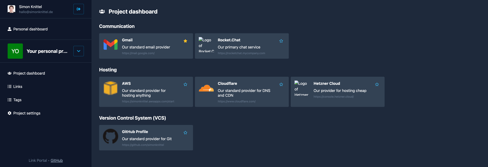

# Link Portal

Simple multitenant web app to manage bookmarks for teams.

_**Note:** This app has been primarily built to test the new app directory of Next.js 13 and a few other things._

## Features

- Create bookmarks
- Group bookmarks with tags
- Create tenants/projects with their own dashboard for bookmarks
- Invite others to join your projects
- Star individual booksmarks to create a personal dashboard
- Authentication via GitHub SSO

## Demo

<https://link-portal-eight.vercel.app/>

_**Note:** This demo may be slow at times. This is mainly due to Prisma not having proper support for PlanetScale in a serverless environment like Vercel yet._

## Technologies

This project has been setup with the [T3 App](https://create.t3.gg/) stack initially.

- [Next.js](https://nextjs.org/)
- [TypeScript](https://www.typescriptlang.org/)
- [Tailwind CSS](https://tailwindcss.com/)
- [Prisma](https://www.prisma.io/)
- [PlanetScale](https://planetscale.com/)
- [Vercel](https://vercel.com/)
- [NextAuth.js](https://next-auth.js.org/)
- [React Table](https://github.com/TanStack/table)
- [react-hot-toast](https://github.com/timolins/react-hot-toast)
- [React Icons](https://github.com/react-icons/react-icons)
- [Playwright](https://playwright.dev/)
- [Terraform](https://www.terraform.io/)
- [Zod](https://github.com/colinhacks/zod)
- [Mailgun](https://www.mailgun.com/)

## Usage

### Requirements

- [nvm](https://github.com/nvm-sh/nvm)

### Setup

1. Configure environment variables: Duplicate `app/.env.example` to `app/.env` and fill in the blanks.
2. Install required Node.js version: `nvm use`
3. Start up the database: `docker compose up`
4. Update the database's schema: `npx prisma db push`
5. Run the app: `cd app/ && npm run dev`
6. Access the app at: <http://localhost:3000>

### Playwright tests

- Start up the database: `docker compose up`
- Run the tests: `cd playwright/ && npx playwright test --debug`

## License

See [LICENSE](./LICENSE)
